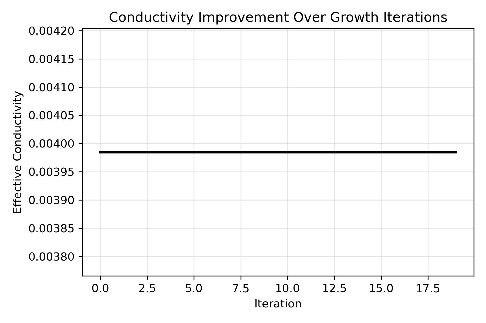
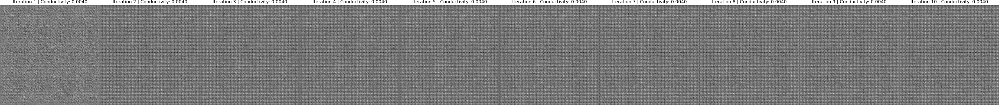

# synthetic_tree_physics
Modeling biomimetic xylem-inspired microstructures using AI latent space representations and physical simulation (Camber integration).
# Synthetic Tree Physics: AI Modeling of Cohesion–Tension Microfluidics

## Abstract
This project investigates the biomechanical principles that enable trees to sustain negative-pressure water transport through microstructured xylem tubes. Using AI-driven latent-space modeling, we simulate and analyze tree-inspired microfluidic geometries to explore synthetic analogues that could replicate or extend these natural fluid-transport systems under extreme conditions. The work integrates procedural geometry generation, unsupervised learning, and physical simulation through Camber.

## Background
Natural trees maintain continuous water columns over 100 m under extreme tension, leveraging microtubular xylem architectures, surface adhesion, and cavitation resilience. Engineering systems fail under similar negative pressures due to macroscopic instability. By abstracting xylem microstructures as data representations, we aim to identify geometric and material properties that stabilize flow in tension-dominated regimes.

## Objectives
1. Generate synthetic microtubular geometries resembling xylem cross-sections.
2. Train an autoencoder to embed these geometries into a latent space organized by fluidic efficiency and cavitation resistance.
3. Use Camber to simulate fluid transport properties within these geometries.
4. Identify latent clusters correlating with desirable transport behaviors for synthetic material design.

## Methods Overview
**Phase 1 – Latent Space Modeling (AI)**
- Procedurally generate 2D "xylem-like" tube structures.
- Encode and reconstruct geometries using a convolutional autoencoder.
- Visualize latent clusters with t-SNE or UMAP.

**Phase 2 – Fluidic Simulation (Physics)**
- Export selected geometries to Camber’s fluid-dynamics solver.
- Measure transport stability, cavitation onset, and flow rate under negative pressure.

## Repository Structure
synthetic_tree_physics/
├── README.md
├── requirements.txt
├── data/
│ └── generated_microtubes/
├── src/
│ ├── generate_structures.py
│ ├── model.py
│ ├── train.py
│ ├── analyze_latent.py
│ └── simulate_fluidics.py
└── notebooks/
└── exploration.ipynb

---

## 🌿 Morphological Analytics

Once the Synthetic Cambium Growth loop has completed, we can visualize how the model adapts its vascular structure to optimize flow.

### Conductivity Improvement
As the latent cambium updates over time, the generated microvascular geometry becomes increasingly efficient at transporting simulated water.

### Morphological Evolution
Below is a timeline of the evolving structures — each frame representing a single cambial feedback iteration.  
You can see the gradual emergence of more continuous, pressure-optimized channels — synthetic xylem in action.

*(Optional)* If latent trajectories were recorded, `latent_drift.png` shows how the system’s internal “genetic code” migrates through its learned material design space.

---
